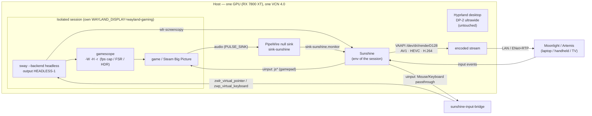
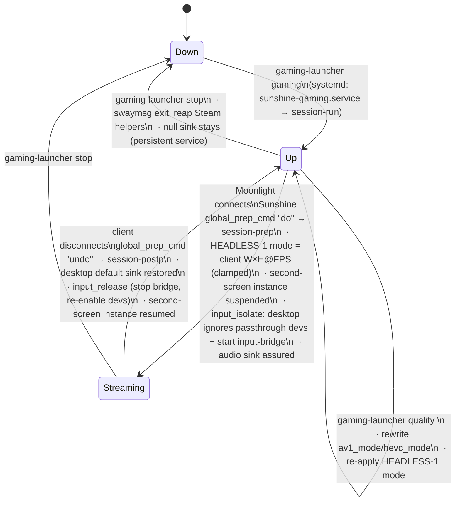

# Architecture

## Data flow

Gamepad axes reach the game directly (Steam Input `EVIOCGRAB`s the `js` node).
Mouse/keyboard/touch can't — a headless wlroots compositor has no libinput
backend, so `sunshine-input-bridge` reads those evdev nodes and replays them into
the nested Sway over the Wayland virtual-input protocols. Meanwhile a managed
`hl.device{ enabled = false }` rule makes the **desktop** Hyprland ignore the
passthrough devices so the client doesn't drive both.

## Lifecycle / state machine

## Design decisions

| Decision | Why |
|---|---|
| **Headless Sway** as capture surface | Upstream Sunshine captures wlroots (`wlr-screencopy`), KMS, or xdg-portal. A headless wlroots output is the only "virtual display" that works; `wlr-screencopy` gained headless-output support upstream. `swaymsg` gives runtime mode changes. |
| **gamescope nested inside** | Decouples game resolution from the "monitor", adds fps cap, FSR/integer scaling, HDR, and a clean fullscreen surface. Optional (`use_gamescope`). |
| **Not `vkms`** | DRM test module: no usable plane/cursor path, can't be a real session output, won't unload while in use. |
| **Single hardware encode** | Navi 32 has **one** VCN 4.0 unit (dual-VCN is Navi 31 / 7900). No VCN0/VCN1 load-balancing; one HW stream at a time. AV1 encode *is* available. |
| **No custom quality daemon** | Moonlight ⇄ Sunshine already negotiate codec + adapt bitrate (FEC, dynamic). We only map the client's resolution/fps onto the headless output via `prep-cmd`, plus named profiles. An opt-in bash "nudge" loop (`quality --auto on`) steps profiles down on sustained loss. |
| **Separate config tree** `~/.config/gaming-setup/` | Polaris and stock Sunshine both use `~/.config/sunshine/`. Full isolation of conf/apps/creds/state/log avoids clobbering an existing setup. |
| **Null sink via `pactl` service**, not a `pipewire.conf.d` drop-in | A malformed drop-in stops the whole PipeWire stack from starting. `pactl load-module` in a `Type=oneshot` user unit (`PartOf=pipewire.service`) can't do that. |
| **Own Sunshine port 47989** | Coexist with (a stopped) Polaris. `status` warns if Polaris is running. |
| **Second screen = separate Sunshine on the desktop** | One Sunshine instance captures exactly one output, fixed at start from `output_name` — a `do` command can't switch the target. So the extra-monitor use case (a headless output on the *desktop* Hyprland, not the nested Sway) needs its own slim instance on port 48020. Sunshine's wlr `output_name` is a **numeric index** (from its `[wlgrab] Monitor N` list), not a connector name. |

## Components

| File | Role |
|---|---|
| `bin/gaming-launcher` | CLI + lifecycle hooks (`session-run`, `session-prep`, `session-postp`) |
| `lib/session.sh` | start/stop headless Sway, start Sunshine in-session, `session_set_mode` |
| `lib/audio.sh` | null-sink assurance, restore desktop default, headset loopback |
| `lib/input.sh` | on connect: managed `hl.device{enabled=false}` so the desktop ignores Sunshine's passthrough devices + start `sunshine-input-bridge` into the nested Sway; undo on disconnect |
| `src/sunshine-input-bridge.c` | libevdev → `zwlr_virtual_pointer_v1` / `zwp_virtual_keyboard_v1` forwarder (built to `sunshine-input-bridge`) |
| `lib/quality.sh` | profile resolve/apply, gamescope arg builder, up/down steps |
| `lib/steam.sh` | `.acf` library scan, AppID resolve, Big Picture command |
| `lib/common.sh` | logging, INI reader, JSON state file, defaults |
| `systemd/user/sunshine-gaming.service` | runs `session-run`; `ExecStop=session-down`; `KillMode=mixed` reaps Steam |
| `systemd/user/gaming-null-sink.service` | persistent `sink-sunshine` |
| `systemd/user/gaming-quality-adapter.service` | opt-in auto step-down loop |
